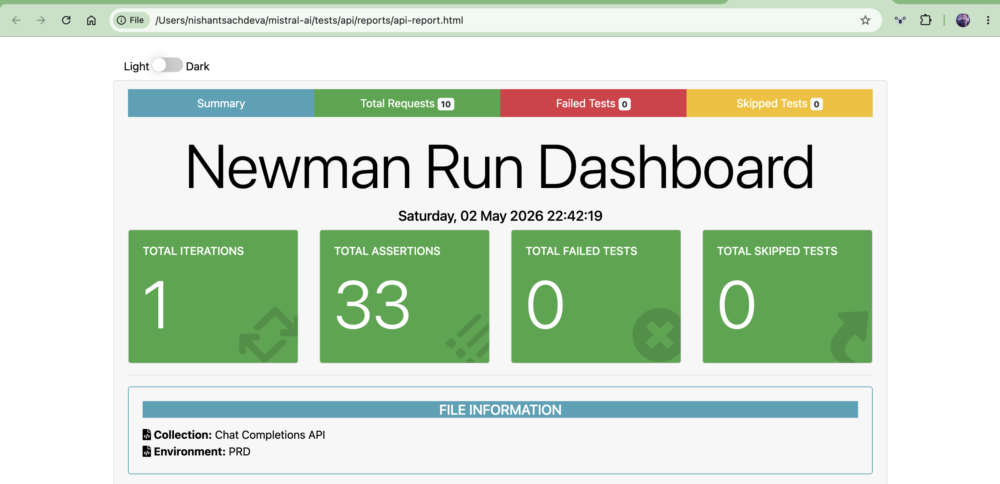

# Mistral AI — API Test Automation

Automated API tests for the Mistral `/v1/chat/completions` endpoint built with Postman and Newman. No SDK used.

---

## Tech Stack

- [Postman](https://postman.com) — API test collection
- [Newman](https://github.com/postmanlabs/newman) — CLI runner for CI/CD
- [newman-reporter-htmlextra](https://github.com/DannyDainton/newman-reporter-htmlextra) — HTML reports

---

## Project Structure

api/
├── Chat Completions API.postman_collection.json    # Postman collection
├── PRD.postman_environment.example.json            # Environment template (safe to commit)
├── PRD.postman_environment.json                    # Your environment with API key (gitignored)
├── reports/
│   └── api-report.html                             # Generated after running tests
└── README.md

---

## Prerequisites

- Node.js v20+
- Newman installed globally

---

## Installation

```bash
sudo npm install -g newman newman-reporter-htmlextra
```

---

## Environment Setup

```bash
cp PRD.postman_environment.example.json PRD.postman_environment.json
```

Open `PRD.postman_environment.json` and add your API key:

```json
{
  "key": "api_key",
  "value": "your_actual_api_key_here"
}
```

Get your API key from [console.mistral.ai](https://console.mistral.ai) → API Keys → Create new key.

---

## Running Tests

### Run full collection
```bash
newman run "Chat Completions API.postman_collection.json" \
  -e "PRD.postman_environment.json" \
  --reporters cli,htmlextra \
  --reporter-htmlextra-export reports/api-report.html
```

### Run a specific folder only
```bash
newman run "Chat Completions API.postman_collection.json" \
  -e "PRD.postman_environment.json" \
  --folder "Happy Path" \
  --reporters cli,htmlextra \
  --reporter-htmlextra-export reports/api-report.html
```

### Run without generating a report
```bash
newman run "Chat Completions API.postman_collection.json" \
  -e "PRD.postman_environment.json"
```

---

## Generating the Report

After running any command above, open the report in your browser:

```bash
open reports/api-report.html        # Mac
start reports/api-report.html       # Windows
```

The report includes:
- Total tests run, passed and failed
- Per-request breakdown with request and response details
- Response time per request
- Console logs captured during the run

---

## Test Results
requests:          28 executed, 0 failed
assertions:        113 executed, 1 known finding
duration:          18s 434ms
avg response time: 684ms




---