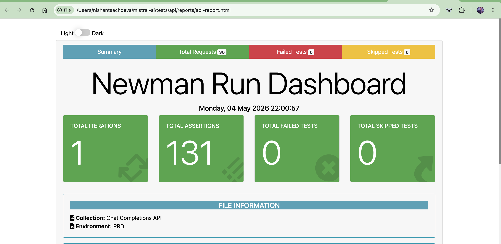

# Mistral AI — API Test Automation

Automated API tests for the Mistral `/v1/chat/completions` endpoint built with Postman and Newman.

---

## Tech Stack

- [Postman](https://postman.com) — API test collection
- [Newman](https://github.com/postmanlabs/newman) — CLI runner for CI/CD
- [newman-reporter-htmlextra](https://github.com/DannyDainton/newman-reporter-htmlextra) — HTML reports

---

## Project Structure  

```
api/
├── docs/
│   └── TestReport.png                              # Latest test run screenshot
├── reports/
│   └── api-report.html                             # Generated after running tests
├── Chat Completions API.postman_collection.json    # Postman collection
├── PRD.postman_environment.example.json            # Environment template (safe to commit)
├── PRD.postman_environment.json                    # Your environment with API key (gitignored)
├── package.json
└── README.md

```
---

## Prerequisites

- Node.js v20+ — [Download here](https://nodejs.org)
- npm v10+ — comes with Node.js automatically

To verify your installation:

```bash
node --version
npm --version
```

---

## Installation

1. Navigate to the api folder

```bash
cd tests/api
```

2. Install Newman

```bash
npm install -g newman newman-reporter-htmlextra
```

---

## Environment Setup

3. Create your environment file

```bash
cp PRD.postman_environment.example.json PRD.postman_environment.json
```

4. Open `PRD.postman_environment.json` and add your API key:

```json
{
  "key": "api_key",
  "value": "your_actual_api_key_here"
}
```

Get your API key from [console.mistral.ai](https://console.mistral.ai) → API Keys → Create new key.

---

## Running Tests

### Run full collection
```bash
newman run "Chat Completions API.postman_collection.json" \
  -e "PRD.postman_environment.json" \
  --reporters cli,htmlextra \
  --reporter-htmlextra-export reports/api-report.html
```

### Run a specific folder only
```bash
newman run "Chat Completions API.postman_collection.json" \
  -e "PRD.postman_environment.json" \
  --folder "Happy Path" \
  --reporters cli,htmlextra \
  --reporter-htmlextra-export reports/api-report.html
```

### Run without generating a report
```bash
newman run "Chat Completions API.postman_collection.json" \
  -e "PRD.postman_environment.json"
```

---

## Generating the Report

After running any command above, open the report in your browser:

```bash
open reports/api-report.html        # Mac
start reports/api-report.html       # Windows
```

The report includes:
- Total tests run, passed and failed
- Per-request breakdown with request and response details
- Response time per request
- Console logs captured during the run

---

## Test Coverage

| Folder | What is tested |
|--------|---------------|
| Happy Path | Valid requests, response structure, token usage |
| Negative Tests | Auth failures, missing fields, invalid model |
| Edge Cases | Empty string, long prompt, max_tokens = 1 |
| Chat Messages & Roles | System, user and assistant role behaviour |
| Multi-Turn Conversation | Context retention across turns |
| Prefix Flag | Forced response prefix, structural requirement |
| Stop Sequence | Single token, array of tokens |
| Safe Prompt | Moderation behaviour with and without flag |
| Model Behavior | JSON mode, determinism, temperature limits, streaming, n completions |

---

## Test Results

```
requests:          32 executed, 0 failed
assertions:        131 executed, 0 failed
duration:          20s 615ms
avg response time: 647ms
```



---